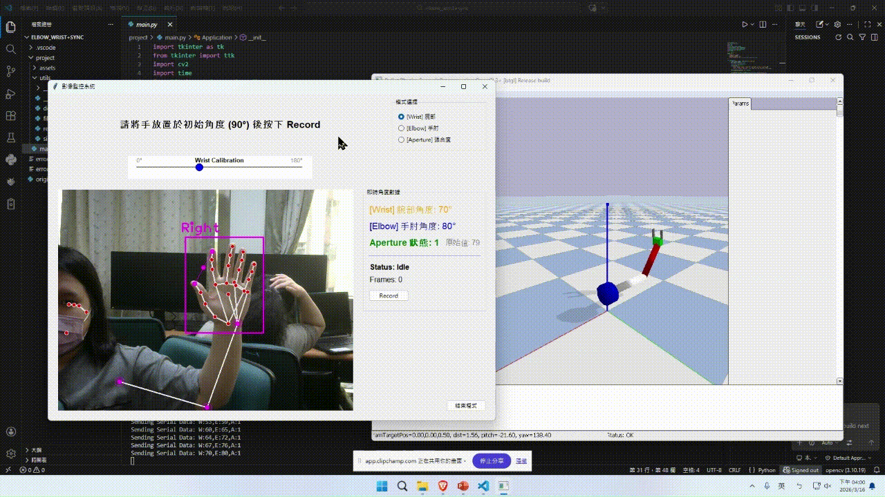

# Elbow–Wrist 視覺追蹤與 PyBullet 手臂模擬

*[English Version Below](#english-version)*

## 專案介紹

我以 webcam 影像中的人體手臂與手部 landmark 為輸入，計算手肘角度、手腕角度及手指張合狀態，並將平滑後的角度映射至 PyBullet 中的 URDF 手臂關節。這個專案讓我練習由影像幾何資訊形成控制參數，再觀察其在機器人模擬中的應用；我也希望以此為基礎，未來研究用機器學習由 2D 影像資訊推進至 3D 空間判斷。

## 視覺到模擬關節的流程

1. 使用 OpenCV 擷取 webcam 影像。
2. 使用 cvzone PoseModule 與 HandTrackingModule 取得人體及手部 landmark。
3. 以肩、肘、腕的 landmark 幾何關係計算手肘角度；以手肘、手腕與手掌相關點計算手腕角度。
4. 以拇指與食指距離判斷手指張合狀態。
5. 對角度訊號使用 median filter 與 scalar Kalman filter 平滑。
6. 將角度轉為 URDF 手臂的目標關節位置，透過 PyBullet position control 更新模擬關節。
7. 專案另包含 CSV 資料記錄及選配的 PySerial 序列輸出流程。

## 使用技術

- Python、OpenCV
- cvzone PoseModule、HandTrackingModule
- Landmark 幾何計算
- Median filter、scalar Kalman filter
- PyBullet、URDF、position control
- Tkinter、Pillow
- CSV 記錄、PySerial 序列介面

## 專案範圍與我的學習

這個原型處理的是影像平面 landmark 幾何量測，以及將角度映射至模擬關節。它沒有完成校準後的人體 3D 姿態重建，也沒有建立通用的人體座標至機器人座標轉換、逆運動學或運動規劃。PyBullet 中的模擬控制也不等同於經驗證的實體手臂控制。

透過這項實作，我進一步理解到視覺 landmark 的輸出仍需經過幾何計算、訊號處理與座標／關節映射，才能成為可供機器人系統使用的輸入。這讓我對電腦視覺、機器人感知及 perception-to-action 整合更感興趣。以機器學習進行 2D-to-3D 空間判斷是後續研究方向，目前專案尚未完成這項功能。

---

# English Version

# Elbow–Wrist Visual Tracking and PyBullet Robotic Arm Simulation

## Project Overview

Using human arm and hand landmarks extracted from webcam feeds as input, this project computes elbow angles, wrist angles, and finger aperture states, mapping the smoothed angles to URDF robotic arm joints in PyBullet. Through this project, I explored transforming visual geometric information into control parameters and observing their application in robotic simulation. Building upon this foundation, I aim to explore machine learning methods to advance from 2D visual information to 3D spatial estimation in future work.

## Vision-to-Simulation Joint Pipeline

1. Capture webcam video frames using OpenCV.
2. Extract body pose and hand landmarks using cvzone `PoseModule` and `HandTrackingModule`.
3. Compute elbow angle from geometric relationships among shoulder, elbow, and wrist landmarks; compute wrist angle from elbow, wrist, and palm landmark points.
4. Determine finger aperture state (open/close) based on the distance between thumb and index fingertips.
5. Smooth angle signals using a median filter combined with a scalar Kalman filter.
6. Map smoothed angles to target URDF joint positions and update simulated joints via PyBullet position control.
7. Includes optional CSV data logging and PySerial serial output pipelines.

## Technologies Used

- Python, OpenCV
- cvzone (`PoseModule`, `HandTrackingModule`)
- Landmark geometric computation
- Median filter, scalar Kalman filter
- PyBullet, URDF, position control
- Tkinter, Pillow
- CSV logging, PySerial serial interface

## Project Scope and Key Learnings

This prototype focuses on 2D image-plane landmark geometric measurements and mapping calculated angles to simulated joints. It does not perform calibrated 3D human pose reconstruction, nor does it establish universal human-to-robot coordinate transformations, inverse kinematics (IK), or motion planning. Furthermore, position control in PyBullet simulation is not equivalent to validated physical robot arm control.

Through this implementation, I gained a deeper appreciation of the pipeline required before visual landmarks can serve as viable robot inputs—namely geometric computation, signal conditioning, and coordinate/joint mapping. This experience has deepened my interest in computer vision, robotic perception, and perception-to-action integration. Applying machine learning for 2D-to-3D spatial reasoning represents a promising direction for future research, which is not yet implemented in the current prototype.
